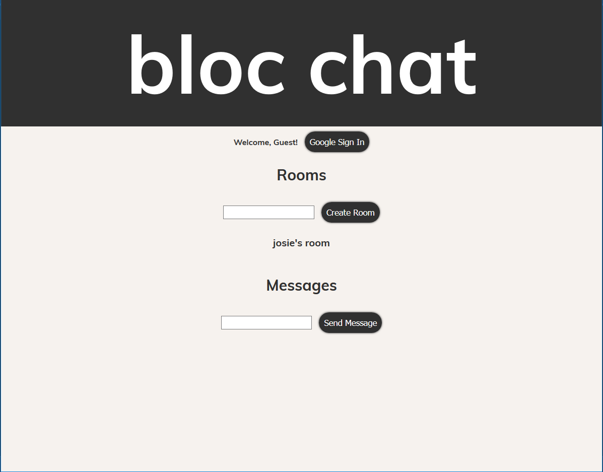
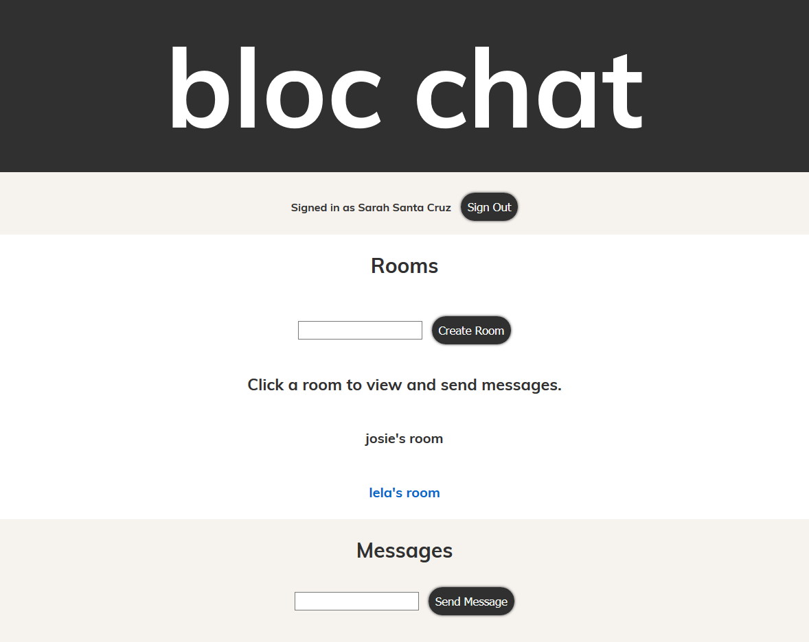
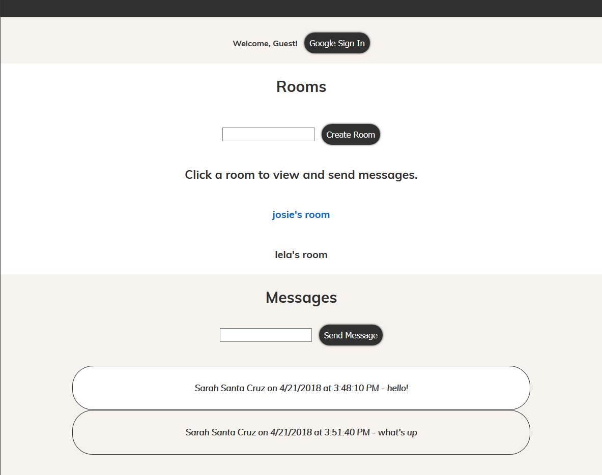

## Bloc Chat (ReactJS Version)

#### Bloc Chat is a web chat application built using React and Firebase. Users can sign in using Firebase's Google Authentication, and can create rooms and messages that belong to a specific room.

[Here is a link to the application](http://critiquemyperformance.herokuapp.com).

### Technologies used

* React
* ES6
* Firebase

### Explanation

Bloc Chat is the first project built on my own using React. I was given wireframes and user stories, and from those I had to make the application come to life.

In the application, users can sign in using Google Sign-In, which is implemented with Firebase.  Users can create new rooms, send messages in any room, and view existing room messages. The application is quite simple, which made it easy to create using a new JavaScript library.

### Problem

Understanding how to access firebase data in my components.

### Solution

The following is needed in the constructor function of the component:

    this.roomsRef = this.props.firebase.database().ref('rooms');

Then, you grab a snapshot of the data in the componentDidMount method:

    componentDidMount() {
      this.roomsRef.on('child_added', snapshot => {
        const room = snapshot.val();
        room.key = snapshot.key;
        this.setState({ rooms: this.state.rooms.concat( room ) });
      });
    }

From there, you have access to the data and are free to use it in your functions, asuming you have also passed down firebase as props to that particular component. Here is an example:

    createRoom(event) {
      event.preventDefault();
      if (this.state.newRoomName.length > 3) {
        this.roomsRef.push({ name: this.state.newRoomName });
      } else {
        alert('Room name must contain at least 3 characters.')
      }    
      this.setState({ newRoomName: '' })
    }            

### Problem

Only messages from the selected room should display.

### Solution

I created this function in the MessageList component:

    filterAndDisplayMessages(activeRoom) {
      this.setState({ currentRoomMessages: this.state.messages.filter(message => message.roomId === activeRoom.key) });
    }

And then used componentWillReceiveProps:

    componentWillReceiveProps(nextProps) {
      if (nextProps.activeRoom !== this.props.activeRoom) {
        this.filterAndDisplayMessages( nextProps.activeRoom );
      }
    }   

### Results

Overall, I am happy with how the application turned out. There are still a few more features I would like to add, such as the ability to delete rooms and messages.

### Conclusion

The simplicity of this application made it a perfect project to use to build something on my own with ReactJS. Building Bloc Chat helped me to strengthen my understanding of how components, state, and props work in ReactJS. It was also a great introduction into incorporating Firebase in a ReactJS application.
